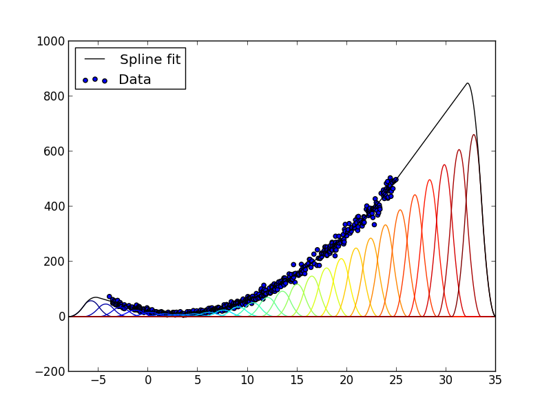

.. index:: Photospline
.. _Photospline:

Photospline
===========

Detector response to a high-energy physics process is often estimated by
Monte Carlo simulation. For purposes of data analysis, the results of this
simulation are typically stored in large multi-dimensional histograms,
which can quickly become unwieldy in terms of size or numerically
problematic due to unfilled bins or interpolation artifacts. Photospline is
a library that uses the `penalized spline technique`_ to efficiently
compute, store, and evaluate B-spline representations of such tables.

.. _`penalized spline technique`: http://dx.doi.org/10.1214/ss/1038425655

Fitting tutorial (Python)
=========================

.. highlightlang:: python

A basic fitting script starts with a few imports::
	
	import numpy
	from photospline import glam_fit, ndsparse, bspline

Some of these are strictly required.

* ``numpy`` - We need this in order to pass n-dimensional arrays around
* ``glam_fit`` - We will use this to perform a least-squares fit of the spline
  coefficients to the data.
* ``ndsparse`` - We will use this sparse N-dimensional grid to pass our data
  to :py:func:`photospline.glam_fit`.

We will also need some extra functions in order to visualize the result.

* :py:func:`photospline.splinetable.grideval` - We will use this function to evaluate the spline surface
  on a coordinate grid.
* :py:func:`photospline.bspline` - We will also plot the individual basis functions to get a
  better idea of how the spline surface is constructed.

For this example, we will make up some random, one-dimensional data drawn
from a cosine overlaid on a polynomial::
	
	numpts = 500
	x1 = numpy.sort(numpy.random.uniform(-4,25,size=numpts))
	z = numpy.random.poisson(numpy.cos(x1)**2 + (x1-3.0)**2 + 10)

We can improve the quality of the fit by giving less weight to data points
that are likely to be distorted by statistical fluctuations. Here we'll use
a minimum weight of 1, and weight the high-occupancy points up::
	
	w = 1. + z

Now we need to choose a set of B-spline basis functions. We will use a
grid of order-2 B-splines that extend beyond the the data points, relying
on the regularization term for extrapolation::
	
	order = 2
	penalty_order = order
	knots = [numpy.linspace(-8,35,30)]
	smooth = 3.14159e3

This generalizes easily to multi-dimensional data; we would simply add an
extra entry to ``knots`` for each extra dimension.

To actually run the fit, we call :py:func:`photospline.glam_fit`::
	
	>>> zs, w = ndsparse.from_data(z, w)
	>>> spline = glam_fit(zs,w,[x1],knots,[order],[smooth],[penalty_order])
	Calculating penalty matrix...
	Calculating spline basis...
	Reticulating splines...
		Convolving bases...
			Convolving dimension 0
		Flattening residuals matrix...
	Transforming fit array...
	Computing least square solution...
	Analyze[27]: 0.000049 s
	Factorize[27]: 0.000027 s
	Solve[27]: 0.000022 s
	Done: cleaning up

Now we can save the fit result for later evaluation with
:py:func:`photospline.splinetable.write` ::
	
	spline.write('splinefit-1d.fits')

To see the result, we can plot it with `matplotlib`_::
	
	import pylab
	# Plot individual basis splines 
	xfine = numpy.linspace(knots[0][0], knots[0][-1], 10001)
	splines = [numpy.array([bspline(knots[0], x, n, order) for x in xfine]) for n in range(0,len(knots[0])-2-1)]
	for n in range(len(splines)):
		pylab.plot(xfine, spline.coefficients[n]*splines[n], color=c)
	# Plot the spline surface (sum of all the basis functions)
	pylab.plot(xfine, spline.grideval([xfine]), label='Spline fit', color='k')
	pylab.scatter(x1, z, label='Data')
	pylab.legend(loc='upper left')
	pylab.show()

.. _matplotlib: http://matplotlib.org/

The result is shown below:

	
	Example 1-dimensional spline fit. The spline surface (black 
	line) is the sum of basis functions (colored lines) weighted with
	coefficients determined by a linear least-squares fit to the data
	(blue dots). In the region to the right where there are no data,
	the order-2 penalty term produces a straight line.

Fitting tutorial (C++)
======================

.. highlightlang:: c++

We can do the same fit as above in C++. We start with a few
necessary includes, namely splinetable and random number generators from the
C++11 standard library::
	
	#include <photospline/splinetable.h>
	#include <random>

As above, we draw Poisson samples from a cosine overlaid on a polynomial. In
contrast to the Python example, though, we fill the data points directly into
a sparse array::
	
	std::default_random_engine rng(0);
	
	size_t numpts = 500;
	// Create a random coordinate vector
	std::vector<double> x1(numpts);
	{
		std::uniform_real_distribution<> uniform(-4,25);
		for (unsigned int i=0; i < numpts; i++)
			x1[i] = uniform(rng);
		std::sort(x1.begin(), x1.end());
	}
	// Create a sparse array to hold the data points and a vector to hold the
	// weights. The length of `weights` should be the number of entries in
	// `zsparse` with non-zero weights
	photospline::ndsparse zsparse(500,1);
	std::vector<double> weights(numpts);
	for (unsigned int i=0; i < numpts; i++) {
		double z = std::poisson_distribution<>(
		    std::pow(std::cos(x1[i]), 2) + std::pow(x1[i]-3.0, 2) + 10)(rng);
		zsparse.insertEntry(z, &i);
		// Use a minimum weight of zero, and weight the high-occupancy points up
		weights[i] = 1. + z;
	}

Now, we set up the spline basis and a smoothing coefficient::
	
	std::vector<double> knots(30);
	for (unsigned int i=0; i < knots.size(); i++) {
		double lo(-8), hi(35);
		knots[i] = lo + i*(hi-lo)/(knots.size()-1);
	}
	
	std::array<uint32_t,1> order = {2};
	auto penalty_order = order;
	double smooth = 3.14159e3;

Then, run the fit. Since :cpp:func:`photospline::splinetable::fit` works on
N-dimensional data in general, we have to put our knot vector, order, smoothing
coefficient, etc. in containers::
	
	photospline::splinetable<> spline;
	spline.fit(zsparse, weights, std::array<decltype(x1),1>({x1}), order, {knots}, {smooth}, penalty_order);

Finally, we store the fit result for later use::
	
	spline.write_fits("splinefit-1d.fits");

Python library reference
========================

.. warning:: This needs to be updated to the 2.0 API

The interface to the fitting library is entirely in Python, using Numpy
arrays to as containers for the data, spline coefficients, knot vectors, 
etc. The spline coefficients determined in the fit are stored in FITS 
files that can be loaded and evaluated using the bundled C library.

.. note::
	The reference Python fitting implementation 
	:func:`photospline.glam.glam.fit` uses
	dense matrix operations from numpy, and can become 
	extremely memory-hungry in large numbers of dimensions.
		
	The C implementation :func:`photospline.spglam.fit`
	implements the same functions as the Python version, but
	uses sparse matrix operations from SuiteSparse_. This is
	both orders of magnitude faster and uses 100x less memory
	for typical problems. You should use spglam for large-scale
	fitting and fall back to glam if necessary for debugging.
	
.. _SuiteSparse: http://www.cise.ufl.edu/research/sparse/

.. autofunction:: photospline.glam.glam.fit

.. function:: photospline.spglam.fit(z, w, coords, knots, order, smooth=1, periods=None, penalties=None, monodim=None)
	
	A drop-in replacement for 
	:py:func:`photospline.glam.glam.fit`.

.. autofunction:: photospline.splinefitstable.write

.. autofunction:: photospline.splinefitstable.read

.. autofunction:: photospline.glam.glam.grideval

.. function:: photospline.spglam.grideval(table, coords)
	
	A drop-in replacement for 
	:py:func:`photospline.glam.glam.grideval`.
	
	.. note:: The ``bases`` argument is not supported in this version.

.. autofunction:: photospline.glam.glam.bspline

C++ library reference
=====================

The photospline C++ library provides :cpp:class:`photospline::splinetable`,
which represents a tensor-product B-spline surface. These can be fit to data
with :cpp:func:`photospline::splinetable::fit`, written to FITS files with
:cpp:func:`photospline::splinetable::write`, read from FITS files with
:cpp:func:`photospline::splinetable::read`, and evaluated with
:cpp:func:`photospline::splinetable::ndsplineeval`.

.. doxygenclass:: photospline::splinetable

C library reference
===================

.. highlightlang:: c

The photospline library also provides wrapper functions to create, read, and
evaluate :cpp:class:`photospline::splinetable` instances from C.

.. doxygenfunction:: ndsplineeval(const struct splinetable *, const double *, const int *, int)

.. doxygenfunction:: splinetable_glamfit

Spline table I/O and manipulation
---------------------------------

.. doxygenfunction:: splinetable_init

.. doxygenfunction:: readsplinefitstable

.. doxygenfunction:: readsplinefitstable_mem
	
	Example::
		
		struct splinetable table;
		struct splinetable_buffer buf;
		
		readsplinefitstable("foo.fits", &table);
		writesplinefitstable_mem(&buf, &table);
		splinetable_free(&table);
		
		readsplinefitstable_mem(&buf, &table);
		free(buf.data);
		/* do stuff with table */
		splinetable_free(&table);

.. doxygenfunction:: writesplinefitstable

.. doxygenfunction:: writesplinefitstable_mem

.. doxygenfunction:: splinetable_get_key

.. doxygenfunction:: splinetable_read_key

.. doxygenfunction:: splinetable_convolve

.. doxygenfunction:: splinetable_free

Spline evaluation
-----------------

.. doxygenfunction:: tablesearchcenters

.. doxygenfunction:: ndsplineeval(const struct splinetable *, const double *, const int *, int)

.. doxygenfunction:: ndsplineeval_gradient(const struct splinetable *, const double *, const int *, double *)

